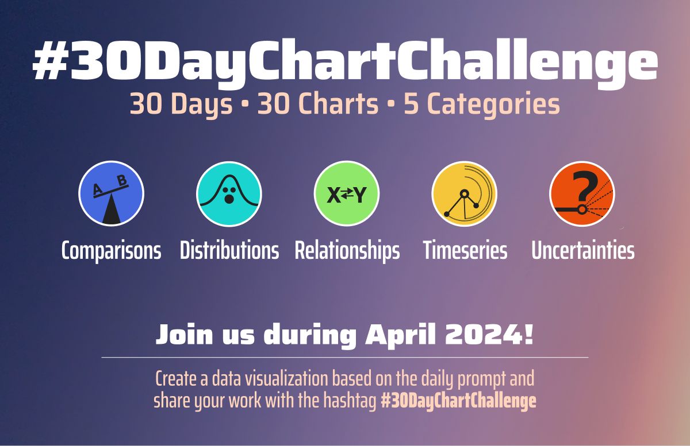

    <em>Collection of contributions to and resources for the fourth <a href="https://twitter.com/30DayChartChall">#30DayChartChallenge</a> in April 2024.</em>

## How to contribute?

Anyone is welcome to contribute, no matter which data source or tool you use.\
If you share your contributions on X or bsky, please use the hashtag [#30DayChartChallenge](https://twitter.com/search?q=%2330DayChartChallenge) and/or tag the [\@30DayChartCall](https://twitter.com/30DayChartChall) account.

## Topics

## 30DayChartChallenge Topics by Day

-   **Comparisons**\
    1. part-to-whole\
    \
    2. neo\
    \
    3. makeover\
    \
    4. waffle\
    \
    5. diverging\
    \
    6. data day: [OECD](data.oecd.org)\
    
-   **Distributions**\
    7. hazards\
    \
    8. circular\
    \
    9. major/minor\
    \
    10. physical\
    \
    11. mobile-friendly\
    \
    12. theme day: Reuters Graphics\
    
-   **Relationships**\
    13. family\
    \
    14. heatmap\
    \
    15. historical\
    \
    16. weather\
    \
    17. networks\
    \
    18. data day: [Asian Development Bank](data.adb.org)\
    
-   **Timeseries**\
    19. dinosaurs\
    \
    20. correlation\
    \
    21. green energy\
    \
    22. mobility\
    \
    23. tiles\
    \
    24. theme day: [ILO Africa](ilostat.ilo.org/data/africa/)\
    
-   **Uncertainties**\
    25. global change\
    \
    26. AI\
    \
    27. good/bad\
    \
    28. trend\
    \
    29. black & white\
    \
    30. theme day\
    
